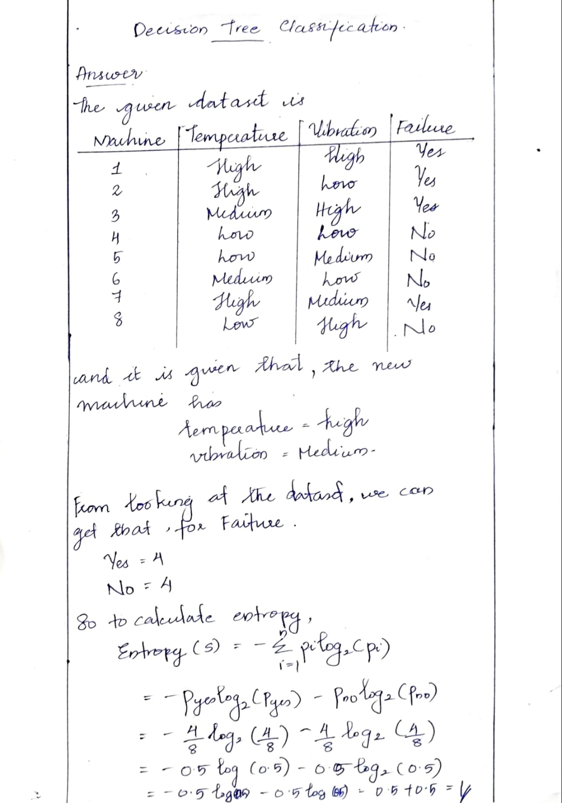
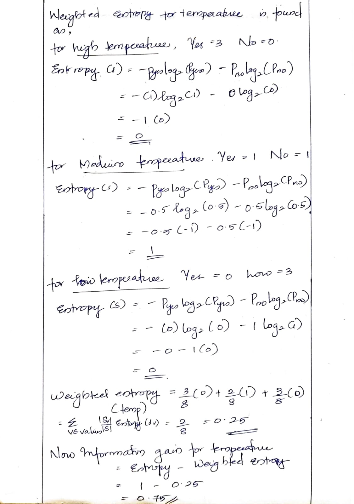
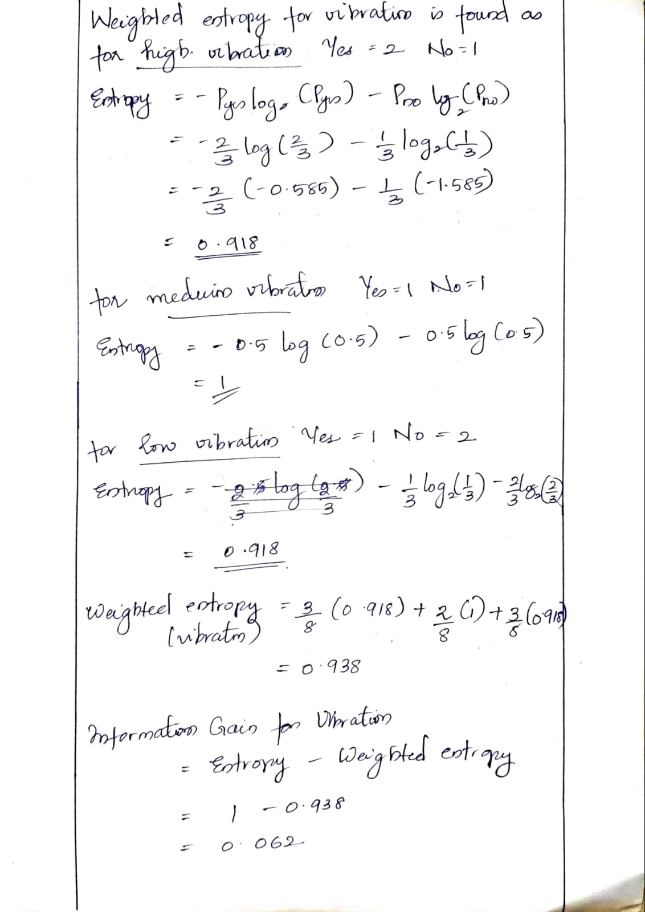
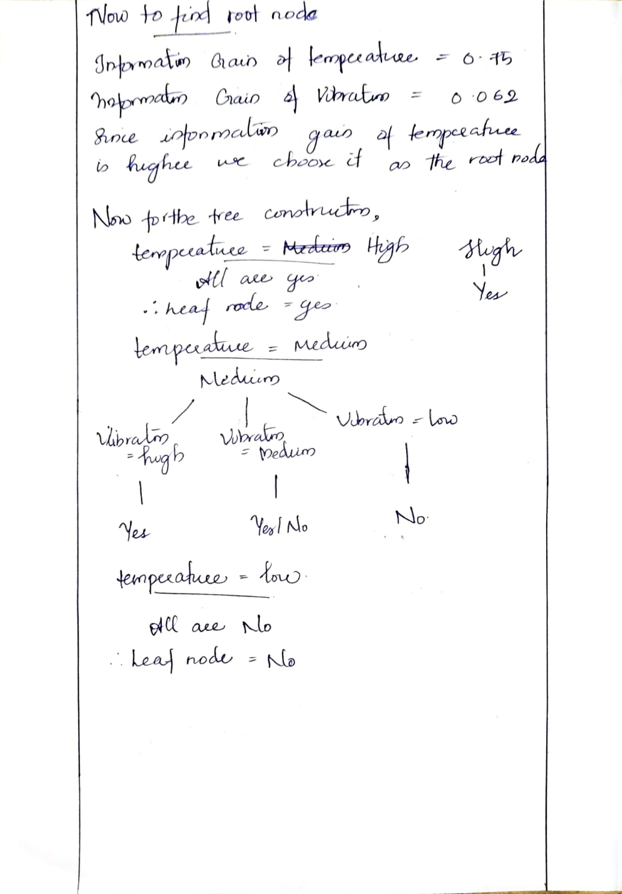
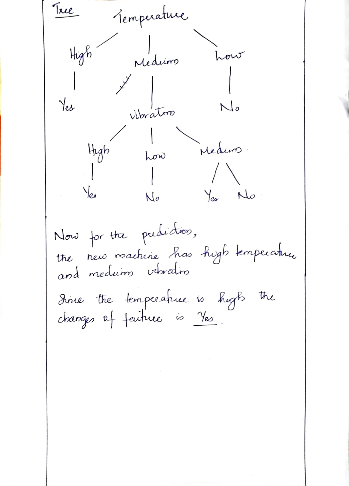
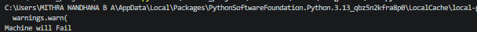
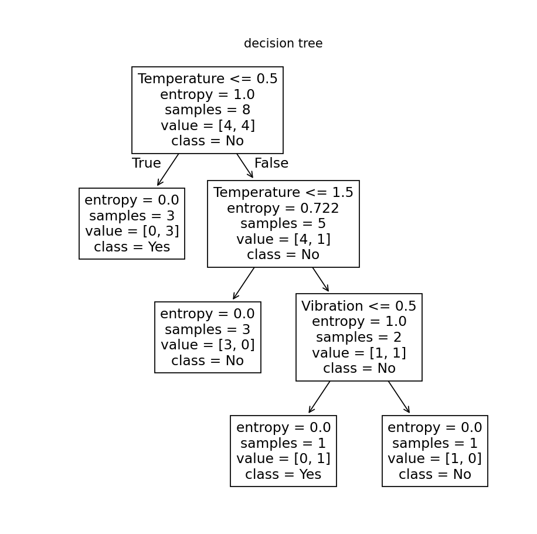

# Assignment6-Decision-Tree-Entropy
Assignment 6 about Decision Tree (Entropy Method) done by Mithra Nandhana B A 

## Problem Statement
A mechanical company wants to predict whether a machine will fail based on the parameters Temperature and Vibration.

## Answer
Below,
1. The Numerical projection of plotting decision tree after finding entropy

*check out the whole pdf:* `Assignment5-Decision-Tree/numericals/numerical.pdf/`

And, implementation of the same is done using python. The code is saved in the `Assignment5-Decision-Tree-Entrpy/assignment/` along with the csv file containing the data and the code and tree.

The code and the output along with tree are given below.

## *Code*

## *Output*

## *Tree*

## Final Answer
Machine will Fail

# What I Learned
By this assignment and class, I learned:
1. Decision Tree

:D
